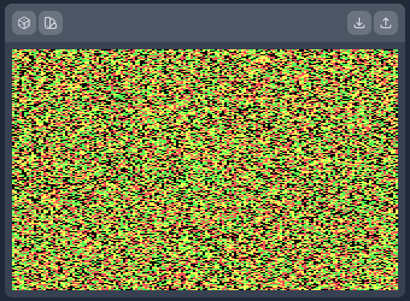

# Color Graphics Adapter of Babel

Every 160x200 screen of every CGA implementation of every Sierra Adventure game ever (and a few other ones too). Brought to you via Blazor.Wasm.

|   |
|:----------------------------------------------------------:|
|   *You remember this screen from Kings Quest III right?*   |

## Why?

I watched a YouTube video by Solar Sands called [The Canvas of Babel](https://www.youtube.com/watch?v=awpVjv2-Ow0) describing a theoretical archive of every image every created (at the provided resolution and colour depth) and as a learning experience wondered if I could implement it myself... using the CGA palette at the resolution of my youth, 160x200.

My direct inspiration is [The Universal Slideshow](http://babelia.libraryofbabel.info/slideshow.html) by Jonathan Basile.

As of the time of writing, I'm not even convinced my implementation can actually show every possible image ever, certainly not via the random image interface. Hopefully this is something I manage to figure out as part of the fun!

## Demo

A version aligned with `main` is available [here](https://gentle-cliff-0226f1c03.1.azurestaticapps.net/).

## Development

### Prerequisites

- .NET 6.0 SDK
- A text editor (or an IDE, I like using JetBrains Rider)

### Technology used

- [TailwindCSS](https://tailwindcss.com/)
- [Blazor.Wasm](https://dotnet.microsoft.com/en-us/apps/aspnet/web-apps/blazor)

